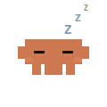

# CC Monitor Pet 🦀

Claude Code의 AI 에이전트 활동을 시각화하는 macOS 데스크탑 펫.  
Claude Code가 작업할 때 화면 위 픽셀아트 캐릭터가 실시간으로 반응합니다.

   

## 화면 예시

캐릭터는 기본적으로 **화면 좌측 하단**에 떠 있습니다.  
모든 앱 위에 항상 표시됩니다.

```
┌─────────────────────────────────────────────────┐
│  ●  macOS Desktop                               │
│                                                  │
│   ┌──────────────────────────┐                  │
│   │                          │                  │
│   │   Claude Code (터미널)    │                  │
│   │                          │                  │
│   │  > 파일 분석 중...        │                  │
│   │                          │                  │
│   └──────────────────────────┘                  │
│                                                  │
│  ┌──────┐                                        │
│  │  🦀  │  ← CC Monitor Pet                      │
│  │      │     (140×140, 항상 최상위)              │
└──┴──────┴────────────────────────────────────────┘
```

> 위치는 앱 종료 후 재시작해도 유지됩니다.

## 기능

### 상태 머신

우선순위에 따라 가장 중요한 상태를 표시합니다.

| 우선순위 | 상태 | 트리거 | 설명 |
|:--------:|------|--------|------|
| 8 | 오류 | 도구 실행 실패 | 3초 후 자동 복귀 |
| 7 | 알림 🔔 | 응답 완료 / 권한 대기 감지 | 점프 3초 → 대기 10초 → idle |
| 6 | 청소 | 컨텍스트 압축 중 | 3초 후 자동 복귀 |
| 5 | 기쁨 | 컨텍스트 압축 완료 | 3초 후 자동 복귀 |
| 4 | 저글링 | 서브에이전트 실행 중 | — |
| 3 | 타이핑 | 프롬프트 입력 / 도구 실행 중 | — |
| 1 | 대기 | 기본 상태 | 마우스를 따라 눈이 움직임 |
| 0 | 수면 | 5분 이상 비활성 | yawning → dozing → collapsing → sleeping |

### 권한 대기 감지

도구 실행 후 2초 내 완료 응답이 없으면 "허용하시겠습니까?" 대기 상태로 판단, 알림 캐릭터가 점프하여 주의를 끕니다.

### 인터랙션

| 동작 | 결과 |
|------|------|
| 좌클릭 | Claude 앱 실행 (없으면 claude.ai 브라우저로 열기) |
| 우클릭 | 종료 메뉴 |

### 기타

- 항상 최상위 레이어 표시 (전체 화면에서도 보임)
- 창 위치 저장 및 재시작 시 복원
- idle 상태에서 마우스 방향으로 눈 트래킹

## 설치 및 실행

**요구사항:** Node.js 18+, macOS

```bash
git clone https://github.com/lilyplan/cc-monitor-pet.git
cd cc-monitor-pet
npm install
npm start
```

## Claude Code 훅 연결

앱 실행 후 아래 명령어로 Claude Code 훅을 등록합니다.

```bash
npm run install-hooks
```

`~/.claude/settings.json`에 13개 이벤트 훅이 자동 등록됩니다.  
이후 Claude Code 사용 시 캐릭터가 자동으로 반응합니다.

> 기존 `settings.json`은 `.bak` 파일로 백업됩니다.

## 훅 제거

```bash
# 백업 파일로 복원
cp ~/.claude/settings.json.bak ~/.claude/settings.json
```

## 구조

```
cc-monitor-pet/
├── src/
│   ├── main.js          # Electron 메인 프로세스, 창 관리
│   ├── preload.cjs      # contextBridge (SVG 로딩, IPC)
│   ├── renderer.js      # 우선순위 상태 머신 + 스프라이트 렌더링
│   ├── server.js        # 로컬 HTTP 서버
│   ├── prefs.js         # 창 위치 저장
│   └── index.html
├── assets/themes/cc/sprites/   # 픽셀아트 SVG 스프라이트 15종
└── hooks/
    ├── hook.js          # Claude Code 훅 스크립트 (stdin → POST)
    └── install.js       # 훅 설치기
```

## 보안

- **외부 네트워크 통신 없음** — 모든 이벤트는 로컬 서버 전용
- Claude Code 훅은 이벤트 JSON을 로컬 서버로 전달하는 역할만 수행
- `contextIsolation: true`로 렌더러와 Node.js 환경 분리

## Credits

[rullerzhou-afk/clawd-on-desk](https://github.com/rullerzhou-afk/clawd-on-desk) 프로젝트에서 아이디어를 얻어 새로 제작했습니다.

## Disclaimer

The Claude character is the property of Anthropic. This is an unofficial fan project and is not affiliated with, endorsed by, or approved by Anthropic.

The artwork in `assets/` is **not** covered by the MIT License. All rights belong to their respective copyright holders. See `assets/LICENSE` for details.

Third-party content: copyright belongs to the respective artists.

## License

The source code in this repository is licensed under the MIT License.  
The artwork in `assets/` is excluded from this license. See the Disclaimer above.
