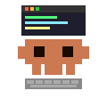
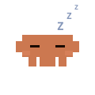

# CC Monitor Pet 🔔

Claude Code가 일할 때 옆에서 같이 반응해주는 **귀여운 데스크탑 펫**입니다.
화면 좌측 하단에 작은 캐릭터가 떠 있으면서, Claude Code의 도구 실행 / 권한 요청 / 작업 완료 같은 이벤트에 맞춰 표정과 동작이 바뀝니다.

   

> macOS (Apple Silicon · M1/M2/M3/M4) 전용

---

## ⚡ 빠른 시작 (5분)

### 1️⃣ 앱 다운로드 & 설치

[**👉 Releases 페이지에서 dmg 다운로드**](https://github.com/lilyplan/cc-monitor-pet/releases/latest)

dmg를 더블클릭하고, 안에 있는 `CC Monitor Pet.app`을 **Applications 폴더로 드래그**합니다.

### 2️⃣ 첫 실행 (한 번만)

서명되지 않은 앱이라 첫 실행 때 macOS가 막을 수 있습니다. 다음 중 하나만 하시면 됩니다:

**A. 터미널 한 줄 (가장 빠름)**

```bash
xattr -dr com.apple.quarantine "/Applications/CC Monitor Pet.app"
open "/Applications/CC Monitor Pet.app"
```

**B. Finder에서 직접 (터미널 없이)**

1. `응용 프로그램` 폴더에서 `CC Monitor Pet`을 **우클릭 → 열기**
2. "확인되지 않은 개발자" 경고가 뜨면 **열기** 버튼 클릭
3. 막혔다면 `시스템 설정 → 개인 정보 보호 및 보안` 맨 아래의 "확인 안 함" 옆 **"이대로 열기"** 클릭

→ 화면 좌측 하단에 주황 구름 캐릭터가 떠 있으면 ✅ 성공입니다.

### 3️⃣ Claude Code 연결 (한 번만)

이 단계가 끝나야 펫이 Claude Code의 작업에 반응할 수 있어요. 터미널에서:

```bash
# 1) 소스를 어딘가에 받습니다 (펫이 Claude Code 이벤트를 받는 통로)
git clone https://github.com/lilyplan/cc-monitor-pet.git ~/Documents/cc-monitor-pet

# 2) Claude Code 훅 등록
cd ~/Documents/cc-monitor-pet
npm install
npm run install-hooks
```

`~/.claude/settings.json`에 펫과 연결되는 훅이 자동으로 추가됩니다.
(기존 설정은 `.bak` 파일로 백업되니 걱정 마세요)

> Node.js 18 이상이 필요합니다. 없다면 [공식 사이트](https://nodejs.org/)에서 LTS 버전을 받으세요.
>
> ⚠️ **clone한 폴더(`~/Documents/cc-monitor-pet`)는 옮기거나 지우지 마세요.** Claude Code 설정이 이 폴더 안의 스크립트를 절대 경로로 참조합니다.

이제 Claude Code를 새로 켜시고 작업 하나 시켜보세요 — 펫이 반응하면 끝!

---

## 🎬 무엇을 해주나요

### 권한 요청 팝업

Claude Code가 도구 실행 권한을 물을 때, **터미널 대신 펫 머리 위에 작은 팝업**이 뜹니다.

```
┌─────────────────────────────┐
│  🔐 Bash                    │  ← 어떤 도구인지 표시
│ [거부]  [허용]  [항상 허용] │
└─────────────────────────────┘
            ▲ 5px
        ┌───────┐
        │  ☁️   │  ← 펫
        └───────┘
```

| 버튼 | 동작 |
|---|---|
| **거부** | 이번 실행 취소 |
| **허용** | 이번 한 번만 허용 |
| **항상 허용** | 같은 도구는 앞으로 묻지 않음 (Claude Code 설정에 규칙으로 저장됨) |

### 상태별 표정

펫은 Claude Code 이벤트에 맞춰 우선순위가 가장 높은 상태로 표정을 바꿉니다.

| 상태 | 언제 |
|---|---|
| 😴 수면 | 5분 이상 아무 일 없을 때 (yawning → sleeping 순으로 천천히) |
| 👀 대기 | 평소. 마우스 따라 눈이 움직여요 |
| 🤔 생각 중 | 생각 / 계획 중 |
| ⌨️ 타이핑 | 도구 실행 중 |
| 🤹 폭풍 구름 | 서브에이전트 병렬 실행 |
| 🧹 청소 | 컨텍스트 압축 중 |
| 🎉 기쁨 | 압축 완료 / 응답 시작 |
| 🔔 알림 | 작업 완료 / 권한 대기 |
| 💥 오류 | 도구 실행 실패 (3초 후 자동 복귀) |

### 인터랙션

| 동작 | 결과 |
|---|---|
| 좌클릭 | Claude 앱 또는 claude.ai 열기 |
| 우클릭 | 종료 메뉴 / 개발자 도구 |
| 드래그 | 가로로 이동 (위치 기억함) |

---

## 🛠 옵션

### 로그인할 때 자동으로 켜기

**가장 쉬운 방법**: `시스템 설정 → 일반 → 로그인 항목`에서 `+`를 누르고 `/Applications/CC Monitor Pet.app` 선택.

**터미널로 한 번에**:

```bash
osascript -e 'tell application "System Events" to make login item at end with properties {path:"/Applications/CC Monitor Pet.app", hidden:true}'
```

해제할 때:

```bash
osascript -e 'tell application "System Events" to delete login item "CC Monitor Pet"'
```

### MCP로 직접 상태 제어 (고급, 선택)

Claude가 작업 중간에 `signal_pet` 도구로 펫 상태를 직접 바꿀 수 있도록 MCP 서버를 연결할 수 있습니다.

**Claude Code** (`~/.claude.json`):
```json
{
  "mcpServers": {
    "cc-monitor-pet": {
      "command": "node",
      "args": ["/Users/YOUR_NAME/Documents/cc-monitor-pet/mcp/pet-server.js"]
    }
  }
}
```

**Claude Desktop** (`~/Library/Application Support/Claude/claude_desktop_config.json`): 위와 동일한 형식.

> `YOUR_NAME` 자리에 실제 사용자명. 설정 후 Claude를 재시작.

### 펫 제거 / 훅 끄기

펫만 끄기: 우클릭 → 종료
완전히 제거:

```bash
# 1) 펫 종료 후 .app 삭제
osascript -e 'tell application "CC Monitor Pet" to quit'
rm -rf "/Applications/CC Monitor Pet.app"

# 2) Claude Code 훅 원복 (백업본으로)
cp ~/.claude/settings.json.bak ~/.claude/settings.json

# 3) 로그인 항목 해제 (등록했었다면)
osascript -e 'tell application "System Events" to delete login item "CC Monitor Pet"'
```

---

## 🆘 잘 안 될 때

### 펫이 안 보여요

- 다른 모니터에 떠 있을 수도 있어요. `~/Library/Application Support/cc-monitor-pet/settings.json`을 지우면 좌측 하단으로 리셋됩니다.
- 또는 우클릭 → 종료 후 다시 실행.

### Claude Code가 작업하는데 펫이 반응 안 해요

훅이 등록 안 됐을 가능성이 큽니다.

```bash
cd ~/Documents/cc-monitor-pet
npm run install-hooks
```

그래도 안 되면 Claude Code를 한 번 재시작해 보세요.

### 권한 팝업은 뜨는데 클릭해도 Claude Code가 멈춰있어요

`~/Library/Logs/cc-monitor-pet/debug.log` 파일의 마지막 부분을 확인해 보세요. `[server] permission → allow ...` 라인이 보이면 정상 응답된 것이고, 그래도 안 되면 GitHub Issues에 로그와 함께 알려주세요.

### "확인되지 않은 개발자" 경고로 앱이 안 열려요

빠른 시작 **2번** 단계의 `xattr` 명령을 다시 확인해 주세요. 또는 우클릭 → 열기로 첫 실행.

### 더 자세한 디버그가 필요해요

- 메인 프로세스 로그: `~/Library/Logs/cc-monitor-pet/debug.log` (앱 시작할 때마다 새로 작성)
- 권한 팝업의 DevTools를 자동으로 같이 열고 싶으면 [`src/permission-window.js`](src/permission-window.js)의 `DEBUG_DEVTOOLS = false`를 `true`로 바꾸고 `npm run build:mac`으로 재빌드.

---

## 👩‍💻 개발자용

### 소스에서 빌드

```bash
git clone https://github.com/lilyplan/cc-monitor-pet.git
cd cc-monitor-pet
npm install
npm start            # 개발 모드 실행
# 또는
npm run build:mac    # dist/ 에 dmg + .app 생성
```

### 폴더 구조

```
cc-monitor-pet/
├── src/
│   ├── main.js                 # Electron 메인 프로세스 (창 관리)
│   ├── renderer.js             # 스프라이트 렌더링
│   ├── state-machine.js        # 우선순위 상태 머신 + sleep 시퀀스
│   ├── server.js               # 로컬 HTTP 서버 (/state, /permission)
│   ├── permission-window.js    # 권한 팝업 창 컨트롤러
│   ├── permission.html / .js   # 권한 팝업 UI / 렌더러
│   ├── preload.cjs             # 펫 IPC 브릿지
│   ├── permission-preload.cjs  # 팝업 IPC 브릿지
│   ├── prefs.js                # 창 위치 저장
│   └── lib/
│       ├── constants.js        # 공유 상수 (포트, 토큰 경로 등)
│       ├── pet-client.js       # hook.js + MCP 공통 HTTP 클라이언트
│       └── logger.js           # 메인 콘솔 → debug.log 미러링
├── assets/themes/cc/sprites/   # SVG 스프라이트
├── build/
│   ├── icon.svg / .png / .icns # 앱 아이콘
│   └── render-icon.cjs         # SVG → 알파 보존 PNG (Electron 사용)
├── hooks/
│   ├── hook.js                 # Claude Code 이벤트 훅
│   └── install.js              # 훅 자동 등록 스크립트
└── mcp/
    └── pet-server.js           # MCP 서버 (signal_pet 도구)
```

### 권한 응답 스키마

Claude Code 2.1+의 네이티브 `PermissionRequest` HTTP hook을 사용합니다. 펫은 `POST /permission`을 long-poll로 잡고, 사용자가 버튼을 클릭하면 아래 형식으로 응답을 보냅니다:

```json
{
  "hookSpecificOutput": {
    "hookEventName": "PermissionRequest",
    "decision": { "behavior": "allow" }
  }
}
```

"항상 허용"의 경우 `decision`에 `updatedPermissions` 배열을 함께 넣어서, Claude Code가 직접 `~/.claude/settings.json`에 규칙을 저장하도록 위임합니다. (펫은 규칙을 자체적으로 관리하지 않습니다)

자세한 구현은 [`src/server.js`](src/server.js)의 `resolvePermission()` 참고.

---

## 🔒 보안

- **외부 네트워크 통신 없음** — 127.0.0.1에만 바인딩
- **토큰 인증** — 앱 시작 시 랜덤 토큰 생성 (`~/.cc-monitor-pet.token`, 0600), 헤더 불일치 시 403
- **바디 크기 제한** — HTTP 요청 64KB 초과 시 413
- `contextIsolation: true`로 렌더러와 Node.js 환경 분리

---

## Credits

[rullerzhou-afk/clawd-on-desk](https://github.com/rullerzhou-afk/clawd-on-desk)에서 아이디어를 얻어 새로 제작했습니다.

## Disclaimer

The Claude character is the property of Anthropic. This is an unofficial fan project and is not affiliated with, endorsed by, or approved by Anthropic.

The artwork in `assets/` is **not** covered by the MIT License. All rights belong to their respective copyright holders. See `assets/LICENSE` for details.

## License

The source code in this repository is licensed under the MIT License.
The artwork in `assets/` is excluded from this license — see the Disclaimer above.
